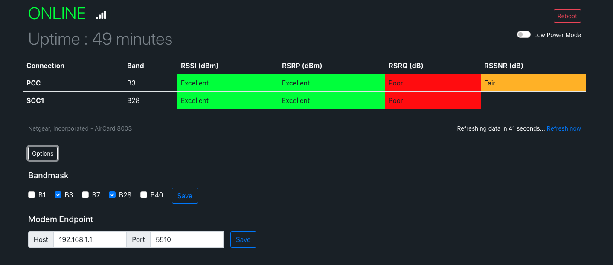

# Aircard-Status
Web interface for viewing general status of Sierra Wireless Aircard modems

 

## Overview
I made this simple web interface to show modems signal quality and to access some settings that are not available through the builtin interface.
The modems ip address and port number are stored in a .env file in the base directory and is required for the app to run. These can later be changed through the web interface. Page design is done with Bootstrap.

## HOWTO
### Install dependencies
`$ pip install -r requirements.txt`
